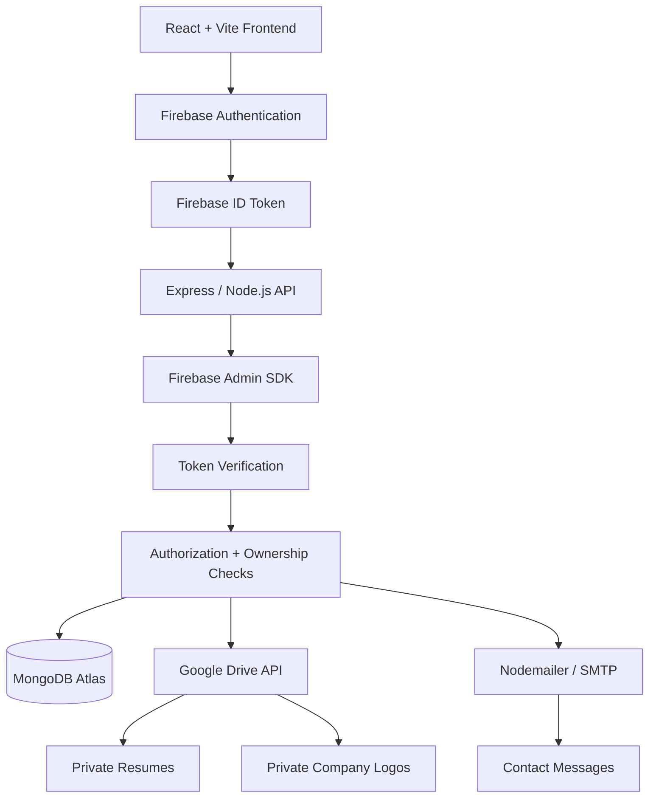

# Job-Merket

<p align="center">
  
</p>

<p align="center">
  A full-stack job and internship platform connecting candidates with recruiters through secure authentication, private resume handling, job management, applicant tracking, and production-ready deployment architecture.
</p>

---

## Overview

**Job-Merket** is a full-stack job and internship platform built to cover the complete hiring workflow for both candidates and recruiters.

The project goes beyond standard CRUD operations by implementing:

- Role-based authentication and authorization
- Secure backend token verification
- Private resume storage and controlled file streaming
- Recruiter ownership validation
- Application-specific resume snapshots
- Real-time persisted hiring status workflows
- Company and job management
- Saved jobs and candidate application tracking
- Recruiter analytics dashboard
- Transactional contact email through Nodemailer
- API rate limiting
- Production CORS configuration
- Environment and secret management
- Route-level code splitting
- Image and bundle optimization
- Full Vercel + Render deployment

The goal was to build a system that behaves like a real production application rather than a frontend-only portfolio demo.

---

# Live Application

**Frontend**

```text
https://job-merket-theta.vercel.app
```

**Backend API**

```text
https://job-merket.onrender.com
```

> The backend may experience a short cold-start delay depending on the hosting tier. Subsequent requests are significantly faster.

---

# Architecture



### Request lifecycle

```text
React Client
    ↓
Firebase Authentication
    ↓
Firebase ID Token
    ↓
Authorization: Bearer <token>
    ↓
Express API
    ↓
Firebase Admin token verification
    ↓
MongoDB user lookup
    ↓
Role + ownership authorization
    ↓
Requested resource
```

Authentication and authorization are intentionally separated.

Firebase handles identity, while MongoDB remains the application's source of truth for:

- User role
- Candidate profile
- Recruiter profile
- Company ownership
- Job ownership
- Applications
- Saved jobs
- Hiring state

---

# Tech Stack

## Frontend

- React
- Vite
- React Router
- Tailwind CSS
- Firebase Authentication
- Lucide React
- Context API
- Custom React hooks
- React.lazy
- Suspense

## Backend

- Node.js
- Express
- MongoDB
- Mongoose
- Firebase Admin SDK
- Google Drive API
- Nodemailer
- Multer
- express-rate-limit

## Infrastructure

- **Frontend:** Vercel
- **Backend:** Render
- **Database:** MongoDB Atlas
- **Authentication:** Firebase Authentication
- **Private file storage:** Google Drive
- **Email:** SMTP through Nodemailer
- **Source control:** Git + GitHub

---

# Core Features

## Candidate Experience

Candidates can:

- Register using email/password
- Sign in using email/password
- Sign in with Google
- Reset forgotten passwords
- Browse jobs
- Browse internships
- Browse companies
- Browse job categories
- Search and filter opportunities
- View detailed job information
- Save and unsave jobs
- Maintain a candidate profile
- Add professional information
- Add skills and experience
- Upload a private resume
- Apply for jobs
- Track submitted applications
- View application status
- Access protected candidate resources

Candidate application states include:

```text
Applied
Under Review
Shortlisted
Hired
Rejected
```

---

## Recruiter Experience

Recruiters have a dedicated hiring portal where they can:

- Register as a recruiter
- Sign in securely
- Create and update a company profile
- Upload a company logo
- Create jobs
- Edit jobs
- Close jobs
- Reopen jobs
- View all jobs belonging to their account
- View applicants
- Filter applicants by job
- Filter applicants by status
- Search applicants
- Securely view applicant resumes
- Shortlist candidates
- Hire candidates
- Reject candidates
- View dashboard hiring statistics
- View recent jobs
- View recent applicants

---

# Recruiter Dashboard

The recruiter dashboard is backed by real MongoDB data rather than mock statistics.

It includes:

```text
Active Jobs
Total Applicants
Shortlisted Candidates
Recent Jobs
Recent Applicants
Applicant counts per recent job
```

Dashboard queries are scoped exclusively to jobs owned by the authenticated recruiter.

---

# Job Management

Recruiters can manage the complete job lifecycle.

Supported job statuses:

```text
draft
open
closed
```

Supported job types:

```text
Full Time
Part Time
Internship
Contract
```

Supported experience levels:

```text
Fresher
Entry Level
Mid Level
Senior Level
```

Supported work modes:

```text
Remote
On-site
Hybrid
```

Jobs support:

- Title
- Company
- Category
- Location
- Work mode
- Job type
- Experience level
- Salary range
- Salary period
- Description
- Responsibilities
- Requirements
- Skills
- Benefits

Salary input is normalized and validated before persistence.

---

# Application Workflow

```text
Candidate
   ↓
Selects a job
   ↓
Backend verifies Firebase token
   ↓
Candidate account verified
   ↓
Resume requirement checked
   ↓
Application created
   ↓
Resume snapshot copied
   ↓
Application stored in MongoDB
   ↓
Recruiter sees applicant
   ↓
Recruiter securely views resume
   ↓
Shortlist / Hire / Reject
   ↓
Status persisted to MongoDB
```

Duplicate applications are prevented through a compound uniqueness constraint between:

```text
candidateId + jobId
```

---

# Secure Resume Architecture

Resume handling is intentionally designed so private documents are never exposed through public Google Drive links.

Candidate resumes are stored privately in Google Drive.

MongoDB stores only the corresponding:

```text
resumeFileId
```

When a candidate applies for a job, Job-Merket creates an **application-specific resume snapshot**.

This is important because if the candidate later replaces their profile resume, an existing application still retains the resume that was submitted at application time.

### Recruiter resume access

```text
Recruiter requests application resume
        ↓
Firebase token verified
        ↓
MongoDB recruiter retrieved
        ↓
Application retrieved
        ↓
Application job retrieved
        ↓
job.recruiterId verified
        ↓
Application resumeFileId retrieved
        ↓
Private Google Drive file streamed
        ↓
Frontend creates temporary Blob URL
```

Recruiters therefore cannot access resumes belonging to jobs owned by another recruiter.

The frontend never receives a permanent public Drive URL.

---

# Company Logo Architecture

Job-Merket supports two logo sources.

### Seeded companies

```text
logoUrl
```

### Recruiter-created companies

```text
logoFileId
```

Recruiter logos are stored privately in Google Drive and served through:

```text
GET /api/companies/:id/logo
```

The frontend dynamically selects the appropriate source:

```text
logoFileId exists
    ↓
Backend logo endpoint

otherwise
    ↓
logoUrl
```

This allows seeded companies and recruiter-created companies to use the same UI.

---

# Authentication

Firebase Authentication manages identity.

Supported authentication methods include:

- Email/password
- Google authentication
- Password reset

Firebase authentication alone is **not treated as authorization**.

After login:

```text
Firebase
   ↓
ID Token
   ↓
Express
   ↓
Firebase Admin verifies token
   ↓
MongoDB user retrieved
   ↓
Application role checked
```

MongoDB stores the application's role:

```text
candidate
recruiter
```

This prevents frontend-controlled role values from becoming authoritative.

---

# Authorization

Job-Merket implements authorization at multiple levels.

## Frontend

`ProtectedRoute` prevents users from entering UI areas belonging to another role.

Examples:

```text
Candidate → /profile
Candidate → /applications
Candidate → /saved-jobs

Recruiter → /recruiter
Recruiter → /recruiter/jobs
Recruiter → /recruiter/applicants
```

Frontend protection is considered a **UX layer only**.

## Backend

Actual security is enforced by the server.

Protected endpoints verify:

1. Firebase token
2. MongoDB user
3. User role
4. Resource ownership where applicable

For example, changing an application status requires verifying:

```text
application.jobId
        ↓
Job
        ↓
job.recruiterId
        ↓
authenticated recruiter._id
```

A recruiter cannot manipulate another recruiter's application simply by obtaining its MongoDB ID.

---

# Security

Security decisions implemented throughout the project include:

### Firebase token verification

Protected backend routes require:

```http
Authorization: Bearer <Firebase ID Token>
```

The token is independently verified using Firebase Admin.

### Server-authoritative authorization

Frontend state is never trusted for sensitive authorization decisions.

### Ownership checks

Recruiters must own the relevant job before they can:

- Manage its applicants
- Change applicant status
- View applicant resumes

### Private file storage

Resumes and recruiter company logos are not publicly exposed.

### Environment isolation

Sensitive configuration is excluded through `.gitignore`.

Examples include:

```text
.env
Firebase service account
Google OAuth secrets
Google Drive refresh token
SMTP password
MongoDB credentials
```

### Firebase Admin secret handling

The Firebase service account is not committed to GitHub.

Production uses a secret file and:

```text
FIREBASE_SERVICE_ACCOUNT_PATH
```

to locate the credential securely.

### Contact form protection

The public contact endpoint is rate limited to reduce SMTP abuse.

Current limit:

```text
5 requests / 15 minutes / IP
```

### Reverse proxy awareness

Express is configured with:

```js
app.set("trust proxy", 1);
```

so production IP-based rate limiting works correctly behind Render's reverse proxy.

### CORS

Production API access is restricted to the configured frontend origin through:

```text
CLIENT_URL
```

---

# Contact System

The Contact page is fully functional.

```text
Contact Form
    ↓
POST /api/contact
    ↓
Backend validation
    ↓
Rate limiter
    ↓
Nodemailer
    ↓
SMTP
    ↓
Site owner inbox
```

The visitor's email is configured as:

```text
replyTo
```

rather than spoofing the SMTP sender address.

This allows the site owner to simply press **Reply** from their email client.

The form includes:

- Controlled inputs
- Required-field validation
- Email validation
- Character limits
- Loading state
- Success state
- Error state
- Accessible labels
- Semantic `role="alert"`
- Semantic `role="status"`

---

# Database Design

## User

Contains:

- Firebase UID
- Name
- Email
- Role
- Position
- Phone
- Location
- Experience
- Skills
- Resume file ID
- Company reference

---

## Company

Contains:

- Name
- Domain
- Website
- Logo URL
- Private logo file ID
- Industry
- Description
- Location
- Company size
- Work modes
- Hiring status
- Source

---

## Category

Contains:

- Name
- Value
- Description
- Icon
- Hiring status
- Source

---

## Job

Contains:

- Title
- Company reference
- Category reference
- Recruiter reference
- Job type
- Experience level
- Location
- Work mode
- Salary
- Description
- Responsibilities
- Requirements
- Skills
- Benefits
- Status
- Source

---

## Application

Contains:

- Candidate reference
- Job reference
- Application status
- Resume snapshot file ID
- Timestamps

A compound unique index prevents duplicate candidate/job applications.

---

## SavedJob

Contains:

- Candidate reference
- Job reference
- Timestamps

Candidate/job pairs are unique.

---

## Resource

Contains:

- Title
- Slug
- Category
- Description
- Content
- Read time
- Level
- Tags
- Featured state
- Published state
- Source

---

# API Overview

## Authentication

```http
POST /api/auth/register
GET  /api/auth/me
```

Additional authenticated profile endpoints support candidate and recruiter profile updates.

---

## Jobs

```http
GET    /api/jobs
GET    /api/jobs/:id
POST   /api/jobs
GET    /api/jobs/recruiter/me
GET    /api/jobs/recruiter/:id
PATCH  /api/jobs/:id
PATCH  /api/jobs/:id/status
```

---

## Applications

```http
POST   /api/applications
GET    /api/applications/me
GET    /api/applications/recruiter/me
PATCH  /api/applications/:id/status
GET    /api/applications/:id/resume
```

---

## Recruiter Dashboard

```http
GET /api/recruiter/dashboard
```

---

## Companies

Public company endpoints provide company discovery and company details.

Private recruiter workflows support:

- Company creation
- Company updates
- Company logo upload

Company logo streaming:

```http
GET /api/companies/:id/logo
```

---

## Saved Jobs

Authenticated candidate endpoints support:

```text
Save job
Remove saved job
Retrieve saved jobs
```

---

## Contact

```http
POST /api/contact
```

Protected by rate limiting and backend validation.

---

# Frontend Architecture

The frontend is structured around reusable responsibilities rather than large monolithic pages.

```text
client/
├── assets/
├── components/
│   ├── authentication/
│   ├── companies/
│   ├── jobs/
│   ├── recruiter/
│   └── resources/
│
├── pages/
│   └── recruiter/
│
├── public/
│
└── src/
    ├── context/
    ├── customHooks/
    ├── firebase/
    ├── data/
    ├── App.jsx
    ├── index.css
    └── main.jsx
```

---

# Backend Architecture

```text
server/
├── middleware/
├── secrets/               # ignored by Git
│
└── src/
    ├── config/
    ├── controllers/
    ├── models/
    ├── routes/
    ├── seed/
    ├── services/
    ├── utils/
    └── server.js
```

Responsibilities are separated into:

```text
Routes
   ↓
Controllers
   ↓
Services / Utilities
   ↓
Models / External APIs
```

---

# DRY Principles

Shared logic is extracted where reuse provides meaningful value.

Examples include:

- Authentication context
- Candidate context
- Generic public `useFetch` hook
- URL-filter hooks
- Opportunity suggestion hooks
- Protected route wrapper
- Reusable job cards
- Reusable company cards
- Reusable confirmation modal
- Shared pagination
- Shared job parsing utilities
- Shared Google Drive service
- Central Firebase configuration
- Central mail transport configuration

Job normalization utilities include:

```text
toArray()
cleanArray()
parseSalary()
validateSalary()
```

The project intentionally avoids abstracting logic merely for abstraction's sake.

---

# Performance Engineering

Performance was tested against the Vite production build rather than relying only on development-server behavior.

## Route-level code splitting

Non-essential pages use:

```js
React.lazy()
```

with:

```jsx
<Suspense fallback={<PageLoader />}>
```

Examples include:

- Company Details
- Resources
- Resource Details
- Candidate Profile
- Saved Jobs
- Applications
- Recruiter Layout
- Recruiter Dashboard
- Post Job
- Manage Jobs
- Applicants
- Recruiter Profile
- About
- Contact
- Privacy
- Terms

This prevents those routes from being bundled into the initial page requirement.

---

## Production bundle

A production build produced approximately:

```text
Main JavaScript
437.87 kB raw
128.89 kB gzip

CSS
39.20 kB raw
7.52 kB gzip
```

Lazy route chunks remain comparatively small.

The build also avoids Vite's oversized-chunk warning.

---

## Image optimization

Initial images were identified as the largest frontend payload.

### Before

```text
Job-Merket logo     ~902 KB
Hero image         ~1527 KB

Combined           ~2.43 MB
```

### After WebP optimization

```text
Job-Merket logo      42.72 KB
Hero image           154.98 KB

Combined             ~198 KB
```

This reduced the combined image payload by roughly **92%**.

---

## Network handling

Data-fetching logic uses `AbortController` where appropriate so obsolete requests can be cancelled when components unmount.

Reusable public data fetching is handled through a custom `useFetch` hook.

Authenticated endpoints deliberately obtain a Firebase ID token before making protected requests.

---

# Routing

Job-Merket uses React Router with both public and protected routes.

Examples:

```text
/
├── jobs
│   └── :id
├── companies
│   └── :id
├── internships
├── categories
├── resources
│   └── :id
├── about
├── contact
├── privacy
├── terms
├── profile
├── saved-jobs
├── applications
│
└── recruiter
    ├── dashboard
    ├── jobs
    │   ├── new
    │   └── :id/edit
    ├── applicants
    └── profile
```

The recruiter dashboard is also available as the recruiter layout's index route.

A wildcard route provides a dedicated `404` experience.

---

# Loading, Error and Empty States

The UI handles application state rather than assuming successful data.

Examples include:

- Page loading fallback
- Job loading
- Applicant loading
- Dashboard loading
- API error messages
- Contact submission errors
- Empty saved jobs
- Empty applications
- Empty applicants
- Empty recent jobs
- Empty recent applicants
- Job-not-found handling
- Invalid URL / 404 handling
- Confirmation modals
- Disabled action states while requests are running

---

# Accessibility

Accessibility considerations include:

- Semantic HTML
- Associated `<label>` and form-control IDs
- Required input semantics
- `aria-required`
- Accessible button labels
- `aria-label`
- `role="alert"`
- `role="status"`
- Keyboard-accessible buttons and links
- Visible focus states
- Appropriate disabled states
- Descriptive image `alt` text

---

# Google Drive Integration

Google Drive is used for private application files rather than public asset hosting.

OAuth configuration includes separate redirect URIs for:

```text
Local development
Production backend
```

Production callback:

```text
https://job-merket.onrender.com/api/google-drive/oauth2callback
```

The Google OAuth client secret and refresh token remain server-side only.

---

# Environment Variables

## Client

Create:

```text
client/.env
```

Required values include:

```env
VITE_API_URL=

VITE_FIREBASE_API_KEY=
VITE_FIREBASE_AUTH_DOMAIN=
VITE_FIREBASE_PROJECT_ID=
VITE_FIREBASE_MESSAGING_SENDER_ID=
VITE_FIREBASE_APP_ID=
```

Only include Firebase configuration variables actually referenced by:

```text
client/src/firebase/firebase.js
```

Firebase Storage is not used by Job-Merket.

Never place backend secrets inside a `VITE_*` variable because frontend environment values are exposed to the browser bundle.

---

## Server

Create:

```text
server/.env
```

Typical production configuration:

```env
PORT=
CLIENT_URL=

MONGODB_URI=

LOGO_DEV_TOKEN=

GOOGLE_DRIVE_CLIENT_ID=
GOOGLE_DRIVE_CLIENT_SECRET=
GOOGLE_DRIVE_REDIRECT_URI=
GOOGLE_DRIVE_REFRESH_TOKEN=

SMTP_HOST=
SMTP_PORT=
SMTP_SECURE=
SMTP_USER=
SMTP_PASS=
CONTACT_RECEIVER_EMAIL=

FIREBASE_SERVICE_ACCOUNT_PATH=
```

For production on Render:

```env
FIREBASE_SERVICE_ACCOUNT_PATH=/etc/secrets/firebase-service-account.json
```

Do not commit real environment values.

---

# Secret Management

Sensitive files and environment variables are excluded from Git.

Examples:

```text
.env
.env.*
server/secrets/
service account credentials
Google OAuth credentials
SMTP credentials
MongoDB credentials
```

A safe `.env.example` can be committed containing variable names without values.

---

# Local Development

Clone the repository:

```bash
git clone https://github.com/Envyiwnl/Job-Merket.git
cd Job-Merket
```

## Client

```bash
cd client
npm install
npm run dev
```

Default Vite development URL:

```text
http://localhost:5173
```

## Server

```bash
cd server
npm install
npm start
```

Local backend typically runs on:

```text
http://localhost:5001
```

Ensure MongoDB, Firebase Admin, Google Drive OAuth and SMTP configuration are present before starting the backend.

---

# Production Build

From the client directory:

```bash
npm run build
```

Preview the optimized production bundle locally:

```bash
npm run preview
```

This should be used when evaluating bundle performance rather than relying only on Vite's development server.

---

# Seed Data

Job-Merket includes seed utilities for development/demo content including:

- Companies
- Categories
- Jobs
- Resources

Seeded records are marked separately from recruiter-created production records so development seed operations can be handled without indiscriminately deleting user-generated data.

---

# Deployment

## Frontend — Vercel

Configuration:

```text
Root Directory: client
Framework: Vite
Build Command: npm run build
Output Directory: dist
```

Production frontend:

```text
https://job-merket-theta.vercel.app
```

---

## Backend — Render

Configuration:

```text
Root Directory: server
Build Command: npm install
Start Command: npm start
```

Production backend:

```text
https://job-merket.onrender.com
```

Render environment configuration includes:

```env
CLIENT_URL=https://job-merket-theta.vercel.app
```

---

## Firebase

The production frontend domain must be added to:

```text
Firebase Authentication
→ Settings
→ Authorized domains
```

Production domain:

```text
job-merket-theta.vercel.app
```

---

## Google OAuth

Both development and production callbacks should remain registered.

```text
http://localhost:5001/api/google-drive/oauth2callback

https://job-merket.onrender.com/api/google-drive/oauth2callback
```

---

# Production Regression Testing

Before declaring the deployment complete, the following workflows were tested end-to-end:

### Candidate

```text
Register
→ Login
→ Update Profile
→ Upload Resume
→ Browse Jobs
→ Save Job
→ Apply
→ Track Application
```

### Recruiter

```text
Login
→ Configure Company
→ Upload Company Logo
→ Post Job
→ Edit Job
→ Close / Reopen Job
→ View Applicants
→ Open Private Resume
→ Shortlist / Hire / Reject
→ Verify Dashboard Updates
```

### Production infrastructure

```text
Frontend → Backend API
CORS
Firebase authentication
Firebase Admin verification
MongoDB connection
Google Drive streaming
SMTP email
Rate limiting
Direct route refresh
Role-protected routes
404 routes
```

---

# Engineering Decisions

## Why Firebase Auth + MongoDB?

Firebase provides battle-tested authentication while MongoDB remains responsible for domain-specific application state.

This prevents the authentication provider from becoming tightly coupled to business data.

---

## Why verify Firebase tokens on the backend?

A logged-in frontend is not inherently trusted.

Every protected API request carries a Firebase ID token that is independently verified by Firebase Admin before access is granted.

---

## Why aren't frontend role checks enough?

Frontend role checks can be manipulated from browser state.

Therefore:

```text
Frontend role checks → UX
Backend role checks  → Security
```

---

## Why Google Drive for resumes?

Files remain private while the backend controls exactly who can access them.

The frontend receives streamed file data rather than a permanent public storage URL.

---

## Why snapshot resumes per application?

A candidate may update their profile resume after applying.

An application should retain the document that was actually submitted for that specific opportunity.

---

## Why direct authenticated fetches instead of the generic `useFetch` hook?

The shared `useFetch` hook is deliberately kept simple for public GET requests.

Protected requests require:

```text
Firebase user
→ ID token
→ Authorization header
```

so authenticated actions explicitly perform that process instead of complicating every public request.

---

## Why no Recruiter Context?

Recruiter state is primarily page-specific.

A global provider was intentionally avoided because it would add abstraction without meaningful shared state requirements.

Candidate state, by contrast, is shared across jobs, saved jobs, applications and profile-related UI, making `CandidateProvider` worthwhile.

---

# Current Production Scope

Job-Merket currently provides a complete production-style workflow for its intended portfolio scope.

It includes:

```text
Frontend architecture
Backend architecture
Authentication
Authorization
CRUD
Database modeling
Private file management
External APIs
Email delivery
Rate limiting
Performance optimization
Responsive UI
Accessibility
Error handling
Production deployment
Secret management
End-to-end workflow testing
```

---

# Future Engineering Improvements

If the platform were scaled beyond its current portfolio scope, the next engineering layer would include:

- Automated unit tests
- API integration tests
- End-to-end browser tests
- CI/CD quality gates
- Structured production logging
- Error monitoring
- Performance monitoring
- Database backup/recovery strategy
- Redis caching where justified
- Search indexing for larger datasets
- Background job queues
- Broader API abuse prevention
- Email domain verification
- Applicant/recruiter notifications
- Administrative moderation tools
- Audit logging
- Pagination at larger data volumes
- Advanced analytics

These are intentionally considered scaling improvements rather than requirements for the current application scope.

---

# What This Project Demonstrates

Job-Merket demonstrates practical experience across the full software delivery lifecycle:

```text
Requirements
→ UI Architecture
→ React Development
→ State Management
→ API Design
→ Database Modeling
→ Authentication
→ Authorization
→ External Service Integration
→ Security
→ Performance Optimization
→ Git
→ Cloud Deployment
→ Production Debugging
→ Regression Testing
```

It was built as an end-to-end engineering project rather than solely as a UI demonstration.

---

## Job-Merket

**Find. Apply. Grow.**